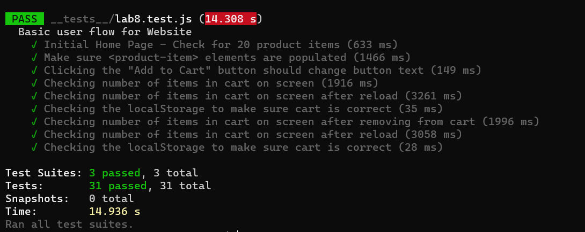
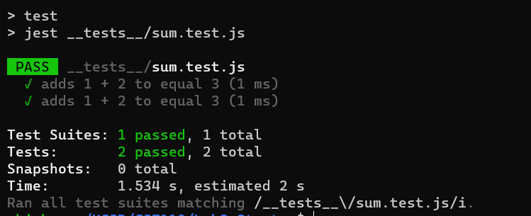
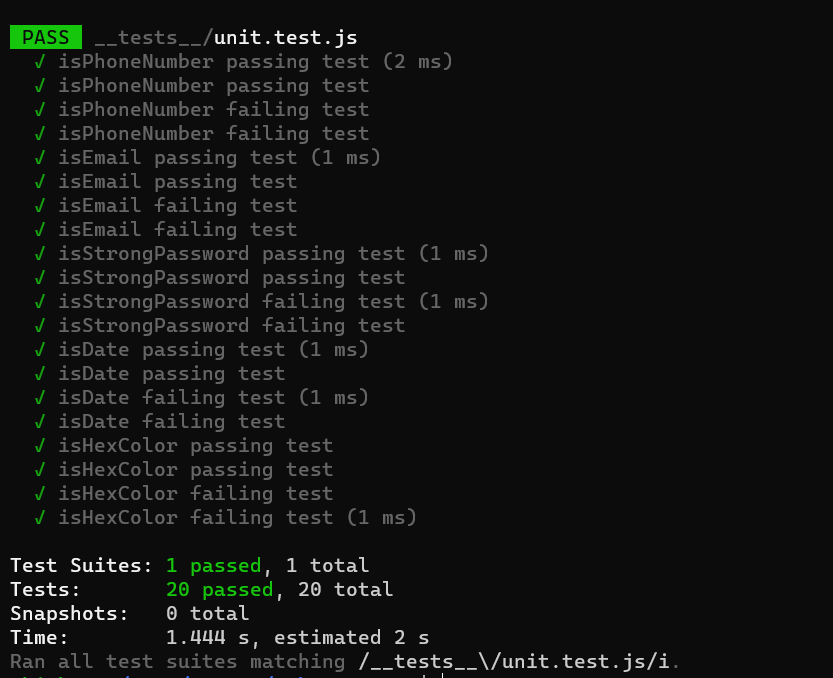

# Lab 8 - Starter

# Author - Jaemok "Christian" Lee

# Screenshots

1) Within a Github action that runs whenever code is pushed
This is part of the CI pipeline and ensures that before code can be integrated into existing code base, it must pass
tests to ensure it works as intended.

2) Would you use an end to end test to check if a function is returning the correct output? (yes/no)

No, this does not rely on user action and can be tested with unit tests.

3) Would you use a unit test to test the “message” feature of a messaging application? Why or why not? For this question, assume the “message” feature allows a user to write and send a message to another user.

No, this feature depends on user actions and requires an end to end test.

4) Would you use a unit test to test the “max message length” feature of a messaging application? Why or why not? For this question, assume the “max message length” feature prevents the user from typing more than 80 characters.

Yes, this is an individual piece of code that can be tested on its own. ie given an input, will it properly limit it to 80 characters.
